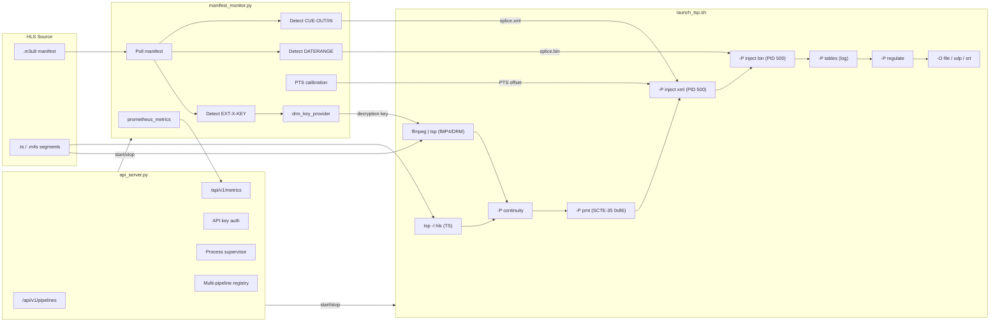

# hls-scte35

HLS-to-MPEG-TS pipeline with SCTE-35 ad marker injection using TSDuck.

Converts live HLS streams (TS or fMP4 segments) to MPEG Transport Stream with proper SCTE-35 splice_insert commands on a dedicated PID, registered in the PMT as stream_type 0x86.

## Architecture



Full diagram source: [docs/architecture.mmd](docs/architecture.mmd)

### Signal Detection

The monitor detects SCTE-35 signals from three sources:

| Signal Type | HLS Tag | Segment Format |
|---|---|---|
| CUE tags | `EXT-X-CUE-OUT` / `EXT-X-CUE-IN` | TS |
| DATERANGE | `EXT-X-DATERANGE` with `SCTE35-CMD` | TS or fMP4 |
| In-band | Passthrough (TSDuck native) | TS |

### SCTE-35 Command Types

`EXT-X-DATERANGE` tags carry the full raw SCTE-35 section in their `SCTE35-CMD` attribute. The pipeline injects these as raw binary sections, preserving all command types and descriptor chains with zero information loss:

| Type | Command | Use Case |
|---|---|---|
| 0x00 | splice_null | Heartbeat / keepalive |
| 0x04 | splice_schedule | Scheduled future events |
| 0x05 | splice_insert | Ad break start/end |
| 0x06 | time_signal | Program boundaries, chapter marks, placement opportunities |
| 0x07 | bandwidth_reservation | Reserved capacity signaling |
| 0xFF | private_command | Vendor-specific extensions |

Type 0x06 (`time_signal`) is the most versatile — it carries `segmentation_descriptor` entries that define events like program start/end, chapter marks, provider/distributor ad opportunities, network boundaries, and unscheduled events. All segmentation types are preserved through raw passthrough.

CUE-OUT/CUE-IN tags (which carry no raw binary) are still reconstructed as `splice_insert` XML commands.

### fMP4 Input

When the source uses fMP4/CMAF segments (`EXT-X-MAP` present in the playlist), the pipeline automatically routes through ffmpeg for transmux:

```
ffmpeg -i <hls_url> -c copy -f mpegts pipe:1 | tsp -I file ...
```

PTS calibration runs automatically to correct for timestamp rebasing during transmux.

### DRM Decryption

The pipeline can ingest DRM-protected HLS streams by decrypting them before processing. Decryption happens upstream of TSDuck via ffmpeg.

| DRM Mode | Description | How It Works |
|---|---|---|
| `none` | No decryption (default) | Direct `tsp -I hls` input |
| `auto` | Detect from `EXT-X-KEY` in manifest | ffmpeg auto-fetches key from URI and decrypts |
| `aes128` | Pre-shared AES-128 key | ffmpeg decrypts with supplied key via `-decryption_key` |

When DRM is active, the pipeline routes through ffmpeg:

```
ffmpeg -decryption_key <key> -i <hls_url> -c copy -f mpegts pipe:1 | tsp -I file ...
```

**Security**: Keys are passed via environment variable (`DRM_KEY`), never via CLI arguments. Keys are redacted in API responses and never written to logs.

### Obtaining Decryption Keys

The pipeline doesn't generate keys — it consumes keys that were created during content encryption. Here's how to get them for each scenario:

**Extract from the manifest directly** (AES-128 identity keyformat):
```bash
# 1. Find the key URI in the manifest
curl -s http://your-source/index.m3u8 | grep EXT-X-KEY
# => #EXT-X-KEY:METHOD=AES-128,URI="https://keyserver.example.com/key/abc123"

# 2. Fetch the raw 16-byte key and convert to hex
curl -s "https://keyserver.example.com/key/abc123" | xxd -p
# => 00112233445566778899aabbccddeeff

# 3. Use it
DRM_KEY=00112233445566778899aabbccddeeff ./bin/launch_tsp.sh \
    --source-url http://your-source/index.m3u8 --drm-mode aes128 \
    --output-mode file --output-file /tmp/decrypted.ts
```

**From your packaging system**: Encoders and packagers (AWS MediaPackage, Unified Streaming, Wowza, etc.) display or export the content key during encryption setup. It's typically shown as a 32-character hex string or a base64 value. If base64, convert:
```bash
echo "ABEiM0RVZneImaq7zN3u/w==" | base64 -d | xxd -p
# => 00112233445566778899aabbccddeeff
```

**Auto mode** (no key needed): If the key server doesn't require authentication, just use `--drm-mode auto` and ffmpeg will fetch the key from the `EXT-X-KEY` URI automatically. If auth is required, add headers in the config:
```toml
[drm]
mode = "auto"
key_server_headers = { Authorization = "Bearer eyJhbG..." }
```

**What you can't use this for**: Widevine and FairPlay keys are not raw AES keys — they require a license exchange protocol. Widevine support (via a license proxy) is planned for a future release. FairPlay requires Apple's proprietary SDK and is not feasible on Linux.

## Supported Environments

| Distro | Versions | Package Manager | Installer Tested |
|---|---|---|---|
| Ubuntu | 22.04, 24.04 | apt | Yes |
| Debian | 12 | apt | Yes |
| Rocky Linux | 8, 9 | dnf | Yes |
| AlmaLinux | 8, 9 | dnf | Yes |
| RHEL | 8, 9 | dnf | Yes |
| Fedora | 39+ | dnf | Yes |

**Architecture**: x86_64 and aarch64 (ARM64). TSDuck packages are available for both.

The installer (`install.sh`) auto-detects the OS and uses the appropriate package manager. On RHEL-family systems it enables EPEL and RPM Fusion for ffmpeg.

### Docker

A multi-stage Dockerfile is included. It builds TSDuck from the official Debian package and runs on Alpine with gcompat for a small image.

```bash
# Build
docker build -t hls-scte35 .

# Run the API server
docker run -p 8080:8080 hls-scte35

# With API key and custom config
docker run -p 8080:8080 \
  -e API_KEY=mysecret \
  -v ./config:/opt/hls-scte35/config:ro \
  hls-scte35

# Run a pipeline directly (no API server)
docker run hls-scte35 \
  ./bin/launch_tsp.sh --source-url http://origin/live.m3u8 --output-mode file

# Docker Compose
docker compose up -d
```

For Kubernetes, each pipeline instance is stateless — the inject directory is ephemeral and logs can be sent to stdout via the API server.

### Alpine Note

TSDuck does not publish Alpine/musl packages. The Dockerfile works around this by extracting Debian TSDuck binaries and running them under Alpine's `gcompat` (glibc compatibility layer). If you encounter issues, use `debian:bookworm-slim` as the base image instead — change `FROM alpine:3.20` to `FROM debian:bookworm-slim` and replace `apk add` with `apt-get install`.

## Prerequisites

- **TSDuck** v3.42+ ([tsduck.io](https://tsduck.io))
- **Python** 3.11+
- **ffmpeg** / **ffprobe** (required for fMP4 input and DRM decryption)

## Quick Start

```bash
# Clone and install
git clone https://github.com/bokelleher/hls-scte35.git
cd hls-scte35
sudo ./install.sh

# Or manually
python3 -m venv venv
source venv/bin/activate
pip install -r requirements.txt
```

### Option 1: Config file

```bash
cp config/pipeline.toml config/pipeline.local.toml
vi config/pipeline.local.toml   # set source.url, output mode, etc.

./bin/launch_tsp.sh config/pipeline.local.toml
python3 ./bin/manifest_monitor.py config/pipeline.local.toml
```

### Option 2: CLI arguments

```bash
# All settings can be passed as CLI flags (override config file values)
./bin/launch_tsp.sh --source-url http://example.com/live/index.m3u8 \
    --output-mode file --output-file /tmp/output.ts

python3 ./bin/manifest_monitor.py --source-url http://example.com/live/index.m3u8 \
    --scte35-pid 500 --mode auto_detect --log-level DEBUG
```

### Option 3: REST API

The API supports multiple concurrent pipelines, each with isolated inject dirs, logs, and output files.

```bash
# Start the API server
python3 ./bin/api_server.py --port 8080

# Start a pipeline — returns an ID
curl -X POST http://localhost:8080/api/v1/pipelines \
  -H "Content-Type: application/json" \
  -d '{
    "source_url": "http://example.com/live/index.m3u8",
    "output_mode": "file"
  }'
# => {"id": "a1b2c3d4", "state": "running", ...}

# List all running pipelines
curl http://localhost:8080/api/v1/pipelines

# Check a specific pipeline
curl http://localhost:8080/api/v1/pipelines/a1b2c3d4

# Stop a specific pipeline
curl -X DELETE http://localhost:8080/api/v1/pipelines/a1b2c3d4

# Stop all pipelines
curl -X DELETE http://localhost:8080/api/v1/pipelines
```

## REST API Reference

Full OpenAPI 3.0.3 specification: **[openapi.yaml](openapi.yaml)**

| Method | Endpoint | Description |
|---|---|---|
| `GET` | `/api/v1/health` | Health check |
| `POST` | `/api/v1/pipelines` | Create and start a new pipeline |
| `GET` | `/api/v1/pipelines` | List all pipelines |
| `GET` | `/api/v1/pipelines/<id>` | Get a specific pipeline's status |
| `DELETE` | `/api/v1/pipelines/<id>` | Stop and remove a specific pipeline |
| `DELETE` | `/api/v1/pipelines` | Stop and remove all pipelines |

Legacy single-pipeline endpoints (`/api/v1/pipeline`) are still supported for backwards compatibility.

### POST /api/v1/pipelines

Request body (JSON):

| Field | Type | Default | Description |
|---|---|---|---|
| `source_url` | string | *required* | HLS manifest URL |
| `output_mode` | string | `"file"` | `file`, `udp`, or `srt` |
| `output_file` | string | `output/live.ts` | Output path (file mode) |
| `scte35_pid` | int | `500` | SCTE-35 PID |
| `output_bitrate` | int | `40000000` | Output bitrate (bps) |
| `mode` | string | `"auto_detect"` | `auto_detect`, `manifest_only`, `inband_only` |
| `poll_interval` | float | `6.0` | Manifest poll interval (seconds) |
| `udp_address` | string | | Multicast address (udp mode) |
| `udp_port` | int | | Multicast port (udp mode) |
| `log_level` | string | `"INFO"` | `DEBUG`, `INFO`, `WARN`, `ERROR` |
| `drm_mode` | string | `"none"` | `none`, `auto`, `aes128` |
| `drm_key` | string | | AES key, 32 hex digits (for `aes128` mode) |
| `drm_iv` | string | | IV, 32 hex digits (optional) |

## CLI Reference

### launch_tsp.sh

```
./bin/launch_tsp.sh [config_file] [options]

Options:
  --source-url URL        HLS manifest URL
  --output-mode MODE      Output: file, udp, srt
  --output-file PATH      Output file path (when mode=file)
  --scte35-pid PID        SCTE-35 PID number
  --output-bitrate BPS    Output bitrate
  --udp-address ADDR      UDP multicast address
  --udp-port PORT         UDP port
  --inject-dir DIR        Splice XML directory
  --drm-mode MODE         DRM: none, auto, aes128
  --drm-key HEX           Pre-shared AES key (32 hex digits)
  --drm-iv HEX            Pre-shared IV (32 hex digits)
```

### manifest_monitor.py

```
python3 ./bin/manifest_monitor.py [config_file] [options]

Options:
  --source-url URL        HLS manifest URL
  --poll-interval SEC     Poll interval in seconds
  --scte35-pid PID        SCTE-35 PID number
  --mode MODE             auto_detect, manifest_only, inband_only
  --inject-dir DIR        Splice XML output directory
  --log-level LEVEL       DEBUG, INFO, WARN, ERROR
  --drm-mode MODE         DRM: none, auto, aes128
  --drm-key HEX           Pre-shared AES key (32 hex digits)
```

## Examples

Each example shows both CLI and REST API usage. The monitor and tsp always run as a pair.

### HLS (TS segments) to local file

Record a live stream with SCTE-35 markers to a local TS file.

**CLI:**
```bash
./bin/launch_tsp.sh --source-url http://origin.example.com/live/index.m3u8 \
    --output-mode file --output-file /recordings/live.ts

python3 ./bin/manifest_monitor.py --source-url http://origin.example.com/live/index.m3u8
```

**API:**
```bash
curl -X POST http://localhost:8080/api/v1/pipelines \
  -H "Content-Type: application/json" \
  -d '{
    "source_url": "http://origin.example.com/live/index.m3u8",
    "output_mode": "file",
    "output_file": "/recordings/live.ts"
  }'
```

### HLS (TS segments) to UDP multicast

Ingest HLS and output to a multicast group for downstream ad splicers.

**CLI:**
```bash
./bin/launch_tsp.sh --source-url http://origin.example.com/live/index.m3u8 \
    --output-mode udp --udp-address 239.1.1.1 --udp-port 5000 \
    --output-bitrate 20000000

python3 ./bin/manifest_monitor.py --source-url http://origin.example.com/live/index.m3u8
```

**API:**
```bash
curl -X POST http://localhost:8080/api/v1/pipelines \
  -H "Content-Type: application/json" \
  -d '{
    "source_url": "http://origin.example.com/live/index.m3u8",
    "output_mode": "udp",
    "udp_address": "239.1.1.1",
    "udp_port": 5000,
    "output_bitrate": 20000000
  }'
```

### HLS (TS segments) to SRT

Feed a remote site over SRT with SCTE-35 signaling intact.

**CLI:**
```bash
./bin/launch_tsp.sh --source-url http://origin.example.com/live/index.m3u8 \
    --output-mode srt

python3 ./bin/manifest_monitor.py --source-url http://origin.example.com/live/index.m3u8
```

SRT address, port, mode, and latency are set in `pipeline.toml` under `[tsduck]`:
```toml
srt_address = "192.168.1.50"
srt_port = 9000
srt_mode = "caller"
srt_latency = 200
```

**API:**
```bash
curl -X POST http://localhost:8080/api/v1/pipelines \
  -H "Content-Type: application/json" \
  -d '{
    "source_url": "http://origin.example.com/live/index.m3u8",
    "output_mode": "srt"
  }'
```

### HLS (fMP4/CMAF segments) to UDP multicast

Ingest an fMP4 HLS source (auto-detected via `EXT-X-MAP` in the playlist). The pipeline routes through ffmpeg for transmux and uses `EXT-X-DATERANGE` tags for SCTE-35 detection.

**CLI:**
```bash
./bin/launch_tsp.sh --source-url http://origin.example.com/cmaf/master.m3u8 \
    --output-mode udp --udp-address 239.2.2.2 --udp-port 5001

python3 ./bin/manifest_monitor.py --source-url http://origin.example.com/cmaf/master.m3u8 \
    --mode manifest_only
```

**API:**
```bash
curl -X POST http://localhost:8080/api/v1/pipelines \
  -H "Content-Type: application/json" \
  -d '{
    "source_url": "http://origin.example.com/cmaf/master.m3u8",
    "output_mode": "udp",
    "udp_address": "239.2.2.2",
    "udp_port": 5001,
    "mode": "manifest_only"
  }'
```

### Manifest-only detection with custom PID

Force manifest-based detection (ignore in-band) and use a non-default SCTE-35 PID.

**CLI:**
```bash
./bin/launch_tsp.sh --source-url http://origin.example.com/live/index.m3u8 \
    --output-mode file --output-file /tmp/out.ts --scte35-pid 600

python3 ./bin/manifest_monitor.py --source-url http://origin.example.com/live/index.m3u8 \
    --scte35-pid 600 --mode manifest_only --log-level DEBUG
```

**API:**
```bash
curl -X POST http://localhost:8080/api/v1/pipelines \
  -H "Content-Type: application/json" \
  -d '{
    "source_url": "http://origin.example.com/live/index.m3u8",
    "output_mode": "file",
    "output_file": "/tmp/out.ts",
    "scte35_pid": 600,
    "mode": "manifest_only",
    "log_level": "DEBUG"
  }'
```

### DRM-protected HLS with pre-shared key

Decrypt an AES-128 encrypted HLS stream using a known content key.

**CLI:**
```bash
# Pass key via environment variable (recommended — avoids /proc exposure)
DRM_KEY=00112233445566778899aabbccddeeff \
./bin/launch_tsp.sh --source-url http://origin.example.com/drm/index.m3u8 \
    --output-mode file --output-file /tmp/decrypted.ts --drm-mode aes128

DRM_KEY=00112233445566778899aabbccddeeff \
python3 ./bin/manifest_monitor.py --source-url http://origin.example.com/drm/index.m3u8 \
    --drm-mode aes128
```

**API:**
```bash
curl -X POST http://localhost:8080/api/v1/pipelines \
  -H "Content-Type: application/json" \
  -d '{
    "source_url": "http://origin.example.com/drm/index.m3u8",
    "output_mode": "file",
    "drm_mode": "aes128",
    "drm_key": "00112233445566778899aabbccddeeff"
  }'
```

### DRM-protected HLS with auto key fetch

Let ffmpeg automatically fetch the key from the `EXT-X-KEY` URI. Useful when the key server doesn't require authentication.

**CLI:**
```bash
./bin/launch_tsp.sh --source-url http://origin.example.com/drm/index.m3u8 \
    --output-mode file --output-file /tmp/decrypted.ts --drm-mode auto

python3 ./bin/manifest_monitor.py --source-url http://origin.example.com/drm/index.m3u8 \
    --drm-mode auto
```

**API:**
```bash
curl -X POST http://localhost:8080/api/v1/pipelines \
  -H "Content-Type: application/json" \
  -d '{
    "source_url": "http://origin.example.com/drm/index.m3u8",
    "output_mode": "file",
    "drm_mode": "auto"
  }'
```

For key servers requiring authentication, set `key_server_headers` in `pipeline.toml`:
```toml
[drm]
mode = "auto"
key_server_headers = { Authorization = "Bearer eyJhbG..." }
```

### Multiple concurrent pipelines (API)

Run several HLS sources through independent SCTE-35 pipelines simultaneously.

```bash
# Start pipeline for channel 1
curl -X POST http://localhost:8080/api/v1/pipelines \
  -H "Content-Type: application/json" \
  -d '{
    "source_url": "http://origin.example.com/ch1/index.m3u8",
    "output_mode": "udp",
    "udp_address": "239.1.1.1",
    "udp_port": 5000
  }'
# => {"id": "a1b2c3d4", "state": "running", ...}

# Start pipeline for channel 2
curl -X POST http://localhost:8080/api/v1/pipelines \
  -H "Content-Type: application/json" \
  -d '{
    "source_url": "http://origin.example.com/ch2/index.m3u8",
    "output_mode": "udp",
    "udp_address": "239.1.1.2",
    "udp_port": 5000
  }'
# => {"id": "e5f6g7h8", "state": "running", ...}

# List all running pipelines
curl http://localhost:8080/api/v1/pipelines

# Check a specific pipeline
curl http://localhost:8080/api/v1/pipelines/a1b2c3d4

# Stop channel 1 only
curl -X DELETE http://localhost:8080/api/v1/pipelines/a1b2c3d4

# Stop all pipelines
curl -X DELETE http://localhost:8080/api/v1/pipelines
```

## Configuration

All settings are in `config/pipeline.toml`. CLI arguments and API parameters override config file values.

```toml
[source]
url = "http://example.com/live/index.m3u8"
poll_interval = 6.0

[scte35]
pid = 500
default_duration = 30.0
mode = "auto_detect"           # auto_detect | manifest_only | inband_only
calibration_enabled = true     # PTS calibration for fMP4 sources

[drm]
mode = "none"                  # none | auto | aes128
# key = "00112233..."         # pre-shared AES key (32 hex digits)
# key_server_headers = { Authorization = "Bearer <token>" }

[tsduck]
output_mode = "udp"            # udp | srt | file
udp_address = "239.1.1.1"
udp_port = 5000
output_bitrate = 40000000

[tuning]
ffmpeg_buffer_mode = "default"   # default | low_latency | custom
ffmpeg_realtime = true           # -re flag for live pacing

[logging]
level = "INFO"
```

## Tuning & Latency

The pipeline has several latency and buffer controls. The right settings depend on your source type and network conditions.

### ffmpeg Buffer Mode

Controls how aggressively ffmpeg buffers the input. Only applies when the pipeline routes through ffmpeg (DRM or fMP4 sources).

| Mode | Settings | Latency | Use When |
|---|---|---|---|
| `default` | ffmpeg defaults (5s analyze, 5MB probe) | Higher (+2-5s) | Unreliable networks, VOD sources |
| `low_latency` | `nobuffer`, `low_delay`, 500ms analyze, 500KB probe | Lower (+0.5-1s) | Stable LAN, low-latency live |
| `custom` | Set `ffmpeg_analyzeduration` and `ffmpeg_probesize` individually | Tunable | Fine-grained control |

```toml
[tuning]
ffmpeg_buffer_mode = "low_latency"

# Or for custom values (microseconds / bytes):
# ffmpeg_buffer_mode = "custom"
# ffmpeg_analyzeduration = 1000000    # 1 second
# ffmpeg_probesize = 1000000          # 1 MB
```

**Via API:**
```bash
curl -X POST http://localhost:8080/api/v1/pipelines \
  -H "Content-Type: application/json" \
  -d '{
    "source_url": "http://origin.example.com/live/index.m3u8",
    "ffmpeg_buffer_mode": "low_latency"
  }'
```

### Real-Time Throttle (`-re` flag)

| Setting | Behavior | Use When |
|---|---|---|
| `true` (default) | ffmpeg paces output to match source timing | Live sources |
| `false` | ffmpeg outputs as fast as possible | VOD-as-live, offline processing |

```toml
[tuning]
ffmpeg_realtime = false    # disable for VOD processing
```

### TSDuck Regulate Bitrate

The regulate plugin paces TS output to a target bitrate. If your source bitrate varies, set this to the peak expected value. If set too low, output will stutter. If set too high, it bursts.

```toml
[tsduck]
output_bitrate = 40000000    # 40 Mbps (used by default)

[tuning]
# Override regulate bitrate independently of output_bitrate:
# regulate_bitrate = 50000000
```

### SRT Latency

Controls the SRT send buffer. Higher values tolerate more packet loss and jitter but add delay.

| Value | Behavior | Use When |
|---|---|---|
| 50-100ms | Minimal delay, sensitive to loss | Clean LAN |
| 200ms (default) | Balanced | LAN/WAN |
| 500-2000ms | Resilient to loss/jitter | Internet, satellite uplinks |

```toml
[tsduck]
srt_latency = 200
```

### PTS Calibration Delay

When the pipeline routes through ffmpeg, PTS calibration probes the output to measure timestamp offset. The delay controls how long to wait before the first probe.

| Value | Tradeoff |
|---|---|
| 5s | Calibrate faster, may fail if pipeline is slow to start |
| 10s (default) | Reliable for most sources |
| 20s+ | For very slow sources or high-latency networks |

```toml
[tuning]
calibration_delay_s = 10.0
```

### Latency Budget Summary

For a typical live HLS source with 6-second segments going through the ffmpeg path:

| Component | Default Latency | With `low_latency` |
|---|---|---|
| HLS segment duration | 6.0s | 6.0s |
| ffmpeg buffer/analyze | 2-5s | 0.5-1s |
| ffmpeg `-re` pacing | ~1 segment | ~1 segment |
| TSDuck processing | <100ms | <100ms |
| SRT latency (if used) | 200ms | 200ms |
| **Total** | **~14-18s** | **~7-13s** |

For low-latency HLS (2s segments, partial segments), the monitor automatically adapts its poll interval and the ffmpeg `low_latency` mode reduces the overall budget significantly.

## Monitoring

The API server exposes Prometheus-native metrics at `GET /api/v1/metrics`. Key metrics include SCTE-35 events detected/injected (by type), manifest poll duration and errors, pipeline state, process restarts, PTS calibration status, and DRM key rotations.

For full setup instructions including Prometheus config, Grafana dashboard panels, alert rules, and InfluxDB/Telegraf integration, see **[docs/monitoring.md](docs/monitoring.md)**.

## API Specification

The full OpenAPI 3.0.3 specification is available at **[openapi.yaml](openapi.yaml)**. Import it into Swagger UI, Redocly, or Postman to explore all endpoints, request/response schemas, and examples.

## Output

The TSDuck pipeline produces a compliant MPEG-TS with:

- **PID 500** carrying SCTE-35 sections (`splice_insert` commands)
- **PMT** updated with stream_type `0x86` and CUEI registration descriptor
- **splice_immediate** mode for manifest-detected signals
- **PTS-timed splices** when PROGRAM-DATE-TIME is available and calibrated

## Validation

```bash
# Analyze output stream
./bin/validate_scte35.sh file output/live.ts

# Quick check with tsanalyze
tsanalyze output/live.ts
# Look for: PID 500 (0x01F4) — SCTE-35, stream_type 0x86
```

## Testing

A synthetic HLS server is included for development:

```bash
# Serve a live HLS playlist with CUE-OUT/CUE-IN every 10 segments
python3 bin/test_hls_server.py --port 8899

# Or with DATERANGE signaling (fMP4 style)
python3 bin/test_hls_server.py --port 8899 --signal-style daterange
```

## Troubleshooting

See **[docs/troubleshooting.md](docs/troubleshooting.md)** for solutions to common issues including missing SCTE-35 signals, unreferenced PIDs, DRM failures, API errors, degraded pipelines, and latency problems.

## TSDuck XML Schema

Splice commands conform to TSDuck v3.42 XML schema (`/usr/share/tsduck/tsduck.tables.model.xml`):

- `unique_program_id` is required when `splice_event_cancel="false"`
- `pts_time` must NOT be present when `splice_immediate="true"`
- All commands are wrapped in `<splice_information_table>`

## License

MIT
